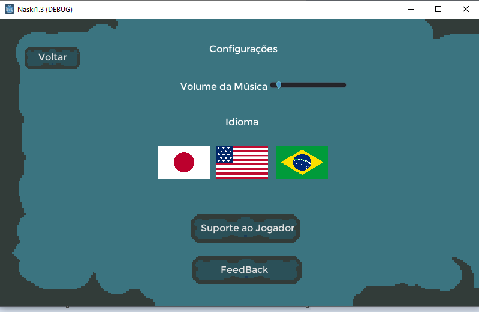

# Trabalho-Final-SI-2021

This is a Pixel art game multiplatform 2D.
- Discover a new adventure.
- You can explore and know the south Brazil culture
- Jump, run, play and much more.

## <b>Screenshots</b>
 

## <b>Details </b>
Game History: [Read this file](https://github.com/jocelinoFG017/Trabalho-Final-SI-2021/blob/master/files/GameHistory.pdf)

Relatory: [Read this file](https://github.com)

## <b> Softwares </b>

Engine: Godot Engine 3.+ win x64

## <b>Last Update</b>
Latest version: 0.5

More details: [Read this file](https://github.com/jocelinoFG017/Trabalho-Final-SI-2021/blob/master/files/LastUpdate.md)

## <b>Before Last Update</b>
last version: 0.4
